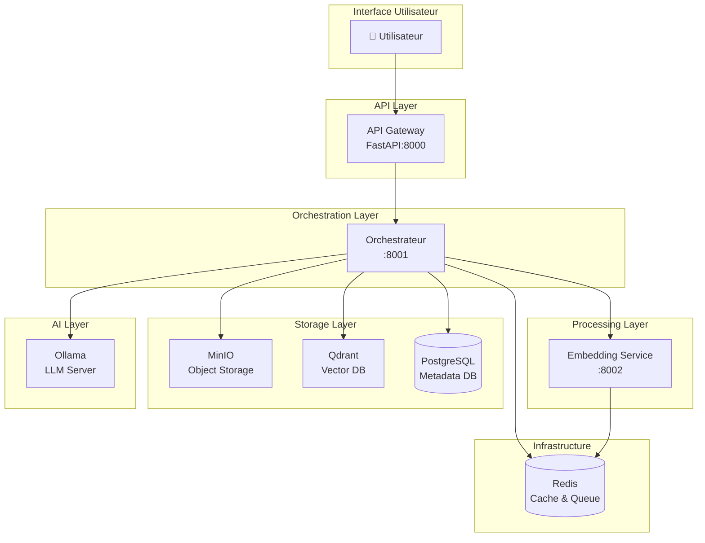
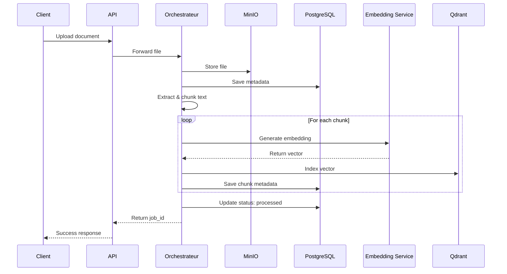
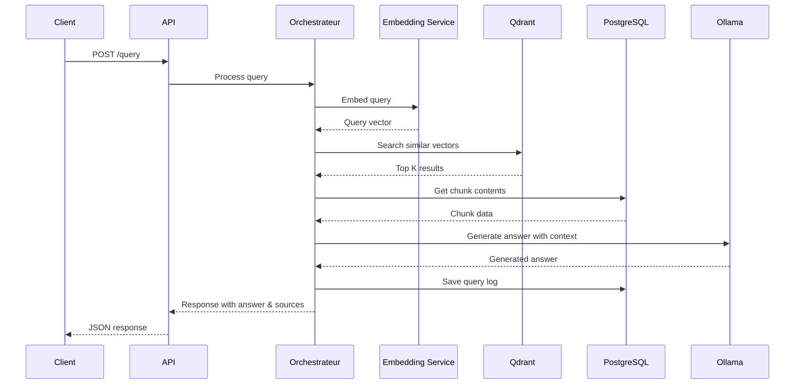

# Architecture OpenRAG

OpenRAG implémente une architecture microservices modulaire et scalable basée sur le pattern RAG (Retrieval-Augmented Generation).

## Vue d'ensemble



## Composants principaux

### 1. API Gateway (Port 8000)

Point d'entrée REST pour toutes les interactions utilisateur.

**Responsabilités :**
- Authentification et autorisation (à venir)
- Validation des requêtes
- Routing vers l'orchestrateur
- Rate limiting
- Documentation API (Swagger)

**Technologies :**
- FastAPI
- Uvicorn (ASGI server)
- Pydantic (validation)

### 2. Orchestrateur (Port 8001)

Cœur du système qui coordonne le workflow RAG complet.

**Responsabilités :**
- Coordination du pipeline d'ingestion de documents
- Gestion du workflow de requêtes
- Communication inter-services
- Gestion des jobs asynchrones
- Monitoring des processus

**Workflow d'ingestion de document :**



**Workflow de requête RAG :**



### 3. Embedding Service (Port 8002)

Service spécialisé pour la génération d'embeddings vectoriels.

**Responsabilités :**
- Génération d'embeddings pour les textes
- Support du traitement par batch
- Optimisation des performances (GPU si disponible)

**Modèles supportés :**
- `sentence-transformers/all-MiniLM-L6-v2` (défaut, 384 dimensions)
- `sentence-transformers/paraphrase-multilingual-MiniLM-L12-v2` (multilingue)
- `sentence-transformers/all-mpnet-base-v2` (meilleur qualité)
- Modèles personnalisés compatibles sentence-transformers

**Configuration :**
```env
EMBEDDING_MODEL=sentence-transformers/all-MiniLM-L6-v2
EMBEDDING_DEVICE=cpu  # ou cuda
EMBEDDING_BATCH_SIZE=32
```

### 4. MinIO (Ports 9000, 9001)

Stockage d'objets S3-compatible pour les documents originaux.

**Responsabilités :**
- Stockage persistant des fichiers uploadés
- Versioning des documents
- Gestion des buckets

**Structure de stockage :**
```
documents/
├── {document_id_1}/
│   └── filename.pdf
├── {document_id_2}/
│   └── rapport.docx
└── ...
```

**Accès :**
- API S3 : `http://localhost:9000`
- Console Web : `http://localhost:9001`

### 5. Qdrant (Ports 6333, 6334)

Base de données vectorielle pour la recherche sémantique.

**Responsabilités :**
- Indexation des vecteurs d'embeddings
- Recherche de similarité (HNSW algorithm)
- Filtrage par métadonnées
- Clustering et optimisation

**Collections :**
- `documents_embeddings` : Collection par défaut
- Collections personnalisées par cas d'usage

**Configuration :**
```yaml
vectors:
  size: 384  # selon le modèle d'embedding
  distance: Cosine  # ou Dot, Euclidean
```

**Payload structure :**
```json
{
  "document_id": "uuid",
  "chunk_index": 0,
  "content": "texte du chunk",
  "metadata": {
    "source_file": "document.pdf",
    "page": 1
  }
}
```

### 6. PostgreSQL (Port 5432)

Base de données relationnelle pour les métadonnées.

**Schéma principal :**

<CodeGroup>

```sql Documents
CREATE TABLE documents (
    id UUID PRIMARY KEY,
    filename VARCHAR(255),
    file_type VARCHAR(50),
    file_size BIGINT,
    minio_object_key VARCHAR(500),
    status VARCHAR(50),
    upload_date TIMESTAMP,
    processed_date TIMESTAMP,
    metadata JSONB,
    created_at TIMESTAMP,
    updated_at TIMESTAMP
);
```

```sql Chunks
CREATE TABLE document_chunks (
    id UUID PRIMARY KEY,
    document_id UUID REFERENCES documents(id),
    chunk_index INTEGER,
    content TEXT,
    vector_id VARCHAR(255),  -- ID dans Qdrant
    metadata JSONB,
    created_at TIMESTAMP
);
```

```sql Queries
CREATE TABLE queries (
    id UUID PRIMARY KEY,
    user_id VARCHAR(255),
    query_text TEXT,
    response_text TEXT,
    sources JSONB,
    execution_time_ms INTEGER,
    created_at TIMESTAMP,
    metadata JSONB
);
```

```sql Collections
CREATE TABLE collections (
    id UUID PRIMARY KEY,
    name VARCHAR(255) UNIQUE,
    description TEXT,
    created_at TIMESTAMP,
    metadata JSONB
);
```

</CodeGroup>

### 7. Ollama (Port 11434)

Serveur LLM local pour la génération de réponses.

**Responsabilités :**
- Exécution des modèles de langage
- Génération de réponses contextualisées
- Gestion du cache de modèles

**Modèles recommandés :**

<CardGroup cols={2}>
  <Card title="Llama 3.1 8B" icon="llama">
    Meilleur rapport qualité/performance
  </Card>
  <Card title="Phi-3 Mini" icon="microsoft">
    Modèle léger et rapide
  </Card>
  <Card title="Gemma 7B" icon="google">
    Excellent pour les tâches analytiques
  </Card>
  <Card title="Mistral 7B" icon="robot">
    Très bon en français
  </Card>
</CardGroup>

**Alternative avec API Cloud :**
```env
LLM_PROVIDER=openai
LLM_MODEL=gpt-4-turbo
OPENAI_API_KEY=sk-...
```

### 8. Redis (Port 6379)

Cache distribué et file de messages.

**Usages :**
- Cache des embeddings récents
- File de tâches asynchrones (avec Celery)
- Session management
- Rate limiting

## Flux de données

### Ingestion de document

1. **Upload** : Document envoyé via API
2. **Stockage** : Sauvegarde dans MinIO
3. **Extraction** : Extraction du texte selon le format
4. **Chunking** : Découpage en morceaux de ~512 tokens
5. **Embedding** : Génération de vecteurs pour chaque chunk
6. **Indexation** : Stockage des vecteurs dans Qdrant
7. **Métadonnées** : Enregistrement en PostgreSQL

### Traitement de requête

1. **Requête** : Question de l'utilisateur
2. **Embedding** : Vectorisation de la requête
3. **Recherche** : Top-K recherche dans Qdrant (cosine similarity)
4. **Récupération** : Obtention des contenus des chunks
5. **Contexte** : Assemblage du contexte pour le LLM
6. **Génération** : LLM génère une réponse
7. **Logging** : Enregistrement de la requête et réponse

## Scalabilité

### Scaling horizontal

Chaque service peut être scalé indépendamment :

```yaml
docker-compose.yml:
  orchestrator:
    deploy:
      replicas: 3
```

### Optimisations

<AccordionGroup>
  <Accordion title="Embedding Service">
    - Utiliser GPU pour les embeddings (10-50x plus rapide)
    - Augmenter le batch size
    - Cacher les embeddings fréquents dans Redis
  </Accordion>
  
  <Accordion title="Qdrant">
    - Activer HNSW index optimization
    - Sharding pour grandes collections (>10M vectors)
    - Quantization pour réduire l'empreinte mémoire
  </Accordion>
  
  <Accordion title="Ollama">
    - Utiliser plusieurs GPUs
    - Activer le parallélisme de requêtes
    - Optimiser les paramètres du modèle
  </Accordion>
  
  <Accordion title="PostgreSQL">
    - Indexer les colonnes fréquemment requêtées
    - Partitioning pour grandes tables
    - Connection pooling (PgBouncer)
  </Accordion>
</AccordionGroup>

## Sécurité

<Warning>
  Configuration de sécurité de base - À renforcer pour la production !
</Warning>

### À implémenter pour la production

- ✅ **Authentication** : JWT tokens, OAuth2
- ✅ **Authorization** : RBAC (Role-Based Access Control)
- ✅ **HTTPS/TLS** : Chiffrement des communications
- ✅ **Secrets Management** : Vault, AWS Secrets Manager
- ✅ **Network Policies** : Isolation des services
- ✅ **Input Validation** : Protection contre les injections
- ✅ **Rate Limiting** : Protection DDoS
- ✅ **Audit Logging** : Traçabilité des opérations

## Monitoring

### Métriques importantes

- **API** : Requêtes/sec, latence, taux d'erreur
- **Orchestrateur** : Jobs en cours, durée moyenne
- **Qdrant** : Temps de recherche, taille des collections
- **PostgreSQL** : Connexions, requêtes lentes
- **Ollama** : Tokens/sec, utilisation GPU/CPU

### Stack de monitoring (optionnel)

```bash
docker-compose --profile monitoring up -d
```

- **Prometheus** : Collecte de métriques
- **Grafana** : Visualisation (dashboards pré-configurés)
- **Loki** : Agrégation de logs

## Prochaines étapes

<CardGroup cols={2}>
  <Card
    title="Guide d'installation"
    icon="download"
    href="/installation/docker-setup"
  >
    Installation complète étape par étape
  </Card>
  <Card
    title="Configuration"
    icon="sliders"
    href="/installation/configuration"
  >
    Paramétrage avancé des composants
  </Card>
  <Card
    title="Déploiement production"
    icon="server"
    href="/deployment/production"
  >
    Best practices pour la production
  </Card>
  <Card
    title="API Reference"
    icon="code"
    href="/api-reference"
  >
    Documentation de l'API
  </Card>
</CardGroup>
