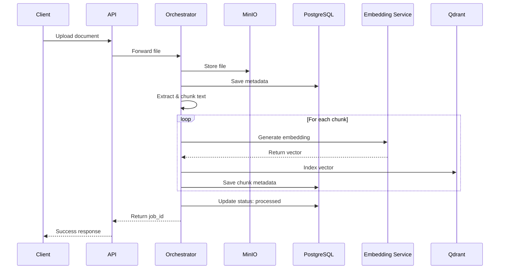

# OpenRAG Architecture

OpenRAG implements a modular and scalable microservices architecture based on the RAG (Retrieval-Augmented Generation) pattern.

## Overview

```mermaid
graph TB
    subgraph "User Interface"
        User[👤 User]
    end
    
    subgraph "API Layer"
        API[API Gateway<br/>FastAPI:8000]
    end
    
    subgraph "Orchestration Layer"
        Orch[Orchestrator<br/>:8001]
    end
    
    subgraph "Processing Layer"
        Embed[Embedding Service<br/>:8002]
    end
    
    subgraph "Storage Layer"
        MinIO[MinIO<br/>Object Storage]
        Qdrant[Qdrant<br/>Vector DB]
        Postgres[(PostgreSQL<br/>Metadata DB)]
    end
    
    subgraph "AI Layer"
        Ollama[Ollama<br/>LLM Server]
    end
    
    subgraph "Infrastructure"
        Redis[(Redis<br/>Cache & Queue)]
    end
    
    User --> API
    API --> Orch
    Orch --> Embed
    Orch --> MinIO
    Orch --> Qdrant
    Orch --> Postgres
    Orch --> Ollama
    Orch --> Redis
    Embed --> Redis
```



## Main Components

### 1. API Gateway (Port 8000)

REST entry point for all user interactions.

**Responsibilities:**
- Authentication and authorization (coming soon)
- Request validation
- Routing to orchestrator
- Rate limiting
- API documentation (Swagger)

**Technologies:**
- FastAPI
- Uvicorn (ASGI server)
- Pydantic (validation)

### 2. Orchestrator (Port 8001)

System core that coordinates the complete RAG workflow.

**Responsibilities:**
- Document ingestion pipeline coordination
- Query workflow management
- Inter-service communication
- Asynchronous job management
- Process monitoring

**Document ingestion workflow:**



**RAG query workflow:**


### 3. Embedding Service (Port 8002)

Specialized service for vector embeddings generation.

**Responsibilities:**
- Text embeddings generation
- Batch processing support
- Performance optimization (GPU if available)

**Supported models:**
- `sentence-transformers/all-MiniLM-L6-v2` (default, 384 dimensions)
- `sentence-transformers/paraphrase-multilingual-MiniLM-L12-v2` (multilingual)
- `sentence-transformers/all-mpnet-base-v2` (better quality)
- Custom sentence-transformers compatible models

**Configuration:**
```env
EMBEDDING_MODEL=sentence-transformers/all-MiniLM-L6-v2
EMBEDDING_DEVICE=cpu  # or cuda
EMBEDDING_BATCH_SIZE=32
```

### 4. MinIO (Ports 9000, 9001)

S3-compatible object storage for original documents.

**Responsibilities:**
- Persistent storage of uploaded files
- Document versioning
- Bucket management

**Storage structure:**
```
documents/
├── {document_id_1}/
│   └── filename.pdf
├── {document_id_2}/
│   └── report.docx
└── ...
```

**Access:**
- S3 API: `http://localhost:9000`
- Web Console: `http://localhost:9001`

### 5. Qdrant (Ports 6333, 6334)

Vector database for semantic search.

**Responsibilities:**
- Embedding vector indexing
- Similarity search (HNSW algorithm)
- Metadata filtering
- Clustering and optimization

**Collections:**
- `documents_embeddings`: Default collection
- Custom collections per use case

**Configuration:**
```yaml
vectors:
  size: 384  # according to embedding model
  distance: Cosine  # or Dot, Euclidean
```

**Payload structure:**
```json
{
  "document_id": "uuid",
  "chunk_index": 0,
  "content": "chunk text",
  "metadata": {
    "source_file": "document.pdf",
    "page": 1
  }
}
```

### 6. PostgreSQL (Port 5432)

Relational database for metadata.

**Main schema:**

<CodeGroup>

```sql Documents
CREATE TABLE documents (
    id UUID PRIMARY KEY,
    filename VARCHAR(255),
    file_type VARCHAR(50),
    file_size BIGINT,
    minio_object_key VARCHAR(500),
    status VARCHAR(50),
    upload_date TIMESTAMP,
    processed_date TIMESTAMP,
    metadata JSONB,
    created_at TIMESTAMP,
    updated_at TIMESTAMP
);
```

```sql Chunks
CREATE TABLE document_chunks (
    id UUID PRIMARY KEY,
    document_id UUID REFERENCES documents(id),
    chunk_index INTEGER,
    content TEXT,
    vector_id VARCHAR(255),  -- ID in Qdrant
    metadata JSONB,
    created_at TIMESTAMP
);
```

```sql Queries
CREATE TABLE queries (
    id UUID PRIMARY KEY,
    user_id VARCHAR(255),
    query_text TEXT,
    response_text TEXT,
    sources JSONB,
    execution_time_ms INTEGER,
    created_at TIMESTAMP,
    metadata JSONB
);
```

```sql Collections
CREATE TABLE collections (
    id UUID PRIMARY KEY,
    name VARCHAR(255) UNIQUE,
    description TEXT,
    created_at TIMESTAMP,
    metadata JSONB
);
```

</CodeGroup>

### 7. Ollama (Port 11434)

Local LLM server for response generation.

**Responsibilities:**
- Language model execution
- Contextualized response generation
- Model cache management

**Recommended models:**

<CardGroup cols={2}>
  <Card title="Llama 3.1 8B" icon="llama">
    Best quality/performance ratio
  </Card>
  <Card title="Phi-3 Mini" icon="microsoft">
    Lightweight and fast model
  </Card>
  <Card title="Gemma 7B" icon="google">
    Excellent for analytical tasks
  </Card>
  <Card title="Mistral 7B" icon="robot">
    Very good in French
  </Card>
</CardGroup>

**Alternative with Cloud API:**
```env
LLM_PROVIDER=openai
LLM_MODEL=gpt-4-turbo
OPENAI_API_KEY=sk-...
```

### 8. Redis (Port 6379)

Distributed cache and message queue.

**Uses:**
- Recent embeddings cache
- Asynchronous task queue (with Celery)
- Session management
- Rate limiting

## Data Flow

### Document Ingestion

1. **Upload**: Document sent via API
2. **Storage**: Saved in MinIO
3. **Extraction**: Text extraction according to format
4. **Chunking**: Split into ~512 token pieces
5. **Embedding**: Vector generation for each chunk
6. **Indexing**: Vector storage in Qdrant
7. **Metadata**: Recording in PostgreSQL

### Query Processing

1. **Query**: User's question
2. **Embedding**: Query vectorization
3. **Search**: Top-K search in Qdrant (cosine similarity)
4. **Retrieval**: Getting chunk contents
5. **Context**: Context assembly for LLM
6. **Generation**: LLM generates response
7. **Logging**: Query and response recording

## Scalability

### Horizontal Scaling

Each service can be scaled independently:

```yaml
docker-compose.yml:
  orchestrator:
    deploy:
      replicas: 3
```

### Optimizations

<AccordionGroup>
  <Accordion title="Embedding Service">
    - Use GPU for embeddings (10-50x faster)
    - Increase batch size
    - Cache frequent embeddings in Redis
  </Accordion>
  
  <Accordion title="Qdrant">
    - Enable HNSW index optimization
    - Sharding for large collections (>10M vectors)
    - Quantization to reduce memory footprint
  </Accordion>
  
  <Accordion title="Ollama">
    - Use multiple GPUs
    - Enable query parallelism
    - Optimize model parameters
  </Accordion>
  
  <Accordion title="PostgreSQL">
    - Index frequently queried columns
    - Partitioning for large tables
    - Connection pooling (PgBouncer)
  </Accordion>
</AccordionGroup>

## Security

<Warning>
  Basic security configuration - Strengthen for production!
</Warning>

### To implement for production

- ✅ **Authentication**: JWT tokens, OAuth2
- ✅ **Authorization**: RBAC (Role-Based Access Control)
- ✅ **HTTPS/TLS**: Communication encryption
- ✅ **Secrets Management**: Vault, AWS Secrets Manager
- ✅ **Network Policies**: Service isolation
- ✅ **Input Validation**: Injection protection
- ✅ **Rate Limiting**: DDoS protection
- ✅ **Audit Logging**: Operation traceability

## Monitoring

### Important Metrics

- **API**: Requests/sec, latency, error rate
- **Orchestrator**: Jobs in progress, average duration
- **Qdrant**: Search time, collection size
- **PostgreSQL**: Connections, slow queries
- **Ollama**: Tokens/sec, GPU/CPU usage

### Monitoring Stack (optional)

```bash
docker-compose --profile monitoring up -d
```

- **Prometheus**: Metrics collection
- **Grafana**: Visualization (pre-configured dashboards)
- **Loki**: Log aggregation

## Next Steps

<CardGroup cols={2}>
  <Card
    title="Installation Guide"
    icon="download"
    href="/installation/docker-setup"
  >
    Complete step-by-step installation
  </Card>
  <Card
    title="Configuration"
    icon="sliders"
    href="/installation/configuration"
  >
    Advanced component configuration
  </Card>
  <Card
    title="Production Deployment"
    icon="server"
    href="/deployment/production"
  >
    Best practices for production
  </Card>
  <Card
    title="API Reference"
    icon="code"
    href="/api-reference"
  >
    API documentation
  </Card>
</CardGroup>
