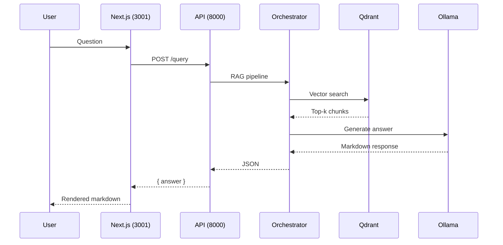

# User Interface

OpenRAG ships a modern chat interface built with **Next.js 14** and **ShadcnUI** components. It replaces the previous Streamlit frontend and provides a cleaner, faster experience with native markdown rendering.

## Overview

| Property | Value |
|----------|-------|
| Framework | Next.js 14 (App Router) |
| UI Library | ShadcnUI + Tailwind CSS v4 |
| Theme | Dark mode (default) |
| Port | 3001 |
| API target | `http://localhost:8000` |

## Running the Interface

The frontend is not containerised — run it with the dev server:

```bash
cd frontend-nextjs
npm install
npm run dev
```

Open [http://localhost:3001](http://localhost:3001).

## Architecture



## Key Features

<CardGroup cols={2}>
  <Card title="Markdown Rendering" icon="markdown">
    LLM responses are rendered as full markdown — headers, bold, lists, code blocks.
  </Card>
  <Card title="Dark Mode" icon="moon">
    Dark theme by default via `<html className="dark">` and ShadcnUI's CSS variables.
  </Card>
  <Card title="Auto-scroll" icon="arrow-down">
    Chat automatically scrolls to the latest message using a `useRef` bottom anchor.
  </Card>
  <Card title="Loading State" icon="spinner">
    Shows "Génération de la réponse..." spinner while the LLM generates (typically 60-90s on CPU).
  </Card>
</CardGroup>

## API Request

Each query sends the following payload to the API:

```json
{
  "query": "User question",
  "collection_id": "default",
  "max_results": 5,
  "use_llm": true
}
```

`use_llm: true` routes through the full RAG pipeline (vector search → context augmentation → LLM generation). Setting it to `false` returns only retrieved chunks without LLM synthesis.

## File Structure

```
frontend-nextjs/
├── app/
│   ├── layout.tsx          # Root layout — dark mode, metadata
│   ├── page.tsx            # Main chat component
│   └── globals.css         # Tailwind + typography imports
├── components/ui/          # ShadcnUI primitives (button, input, card…)
├── package.json
└── tsconfig.json
```

## Dependencies

| Package | Purpose |
|---------|---------|
| `next` | React framework with App Router |
| `shadcn/ui` | Accessible UI component library |
| `react-markdown` | Render LLM markdown responses |
| `@tailwindcss/typography` | `prose` / `prose-invert` styles |
| `lucide-react` | Icon set |

## Production Build

```bash
cd frontend-nextjs
npm run build
npm start          # serves on port 3001
```

For a fully Docker-integrated deployment, add a `Dockerfile` to `frontend-nextjs/` and a service entry in `docker-compose.yml` mapping port 3001.
