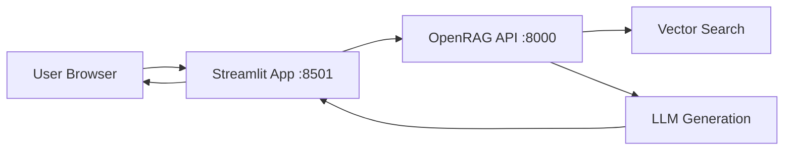

# Streamlit Web Interfaces

OpenRAG provides two web interfaces built with Streamlit for easy interaction with the RAG system without coding.

## Overview

| Interface | Port | Purpose | Users |
|-----------|------|---------|-------|
| **frontend-user** | 8501 | Chat interface for end users | All users |
| **frontend-admin** | 8502 | Admin panel for document management | Administrators |

Both interfaces communicate with the OpenRAG API (port 8000) via REST calls.

## User Chat Interface (Port 8501)

### Features

<CardGroup cols={2}>
  <Card title="Interactive Chat" icon="messages">
    Ask questions and receive AI-generated answers with source citations
  </Card>
  <Card title="Conversation History" icon="clock-rotate-left">
    View previous queries and responses in the session
  </Card>
  <Card title="Source Display" icon="link">
    See which documents were used to generate each answer
  </Card>
  <Card title="Relevance Scores" icon="chart-line">
    View similarity scores for retrieved chunks
  </Card>
</CardGroup>

### Architecture



### Configuration

**Docker Service:**
```yaml
# docker-compose.yml
frontend-user:
  build: ./frontend-user
  container_name: openrag-frontend-user
  ports:
    - "8501:8501"
  environment:
    - API_URL=http://api:8000
    - STREAMLIT_THEME=dark
  depends_on:
    - api
  networks:
    - openrag-network
```

**Environment Variables:**
- `API_URL`: Backend API endpoint (default: http://api:8000)
- `STREAMLIT_THEME`: UI theme (light/dark)
- `MAX_HISTORY`: Maximum messages in chat history (default: 50)

### Accessing the Interface

1. Start OpenRAG:
   ```bash
   sudo docker-compose up -d
   ```

2. Open in browser:
   ```
   http://localhost:8501
   ```

3. Ask a question in the chat input

### Usage Example

**User Input:**
```
What are the main features of this system?
```

**System Response:**
```
Based on the documentation, the main features include:

1. Document Upload Support (PDF, DOCX, TXT, Markdown)
2. Semantic Vector Search with Qdrant
3. LLM-powered Response Generation (Ollama, OpenAI, Claude)
4. Modular Microservices Architecture
5. REST API for programmatic access

Sources:
📄 introduction.pdf (relevance: 0.92)
📄 architecture.pdf (relevance: 0.85)
```

## Admin Dashboard (Port 8502)

### Features

<CardGroup cols={2}>
  <Card title="Document Upload" icon="file-upload">
    Upload PDF, DOCX, TXT, and other supported formats
  </Card>
  <Card title="Document Management" icon="folder-tree">
    View, search, and delete documents
  </Card>
  <Card title="System Statistics" icon="chart-bar">
    Monitor indexed documents, chunks, queries, and performance
  </Card>
  <Card title="Collection Management" icon="layer-group">
    Create and manage document collections
  </Card>
</CardGroup>

### Pages

1. **📊 Dashboard**
   - Total documents indexed
   - Total chunks stored
   - Storage usage
   - Recent queries

2. **📤 Upload Documents**
   - Drag-and-drop or file picker
   - Metadata assignment
   - Collection selection
   - Upload progress tracking

3. **📁 Document Management**
   - List all documents
   - Search by filename/metadata
   - View processing status
   - Delete documents

4. **⚙️ Settings**
   - API configuration
   - LLM model selection
   - Chunk size settings
   - Collection management

### Configuration

**Docker Service:**
```yaml
# docker-compose.yml
frontend-admin:
  build: ./frontend-admin
  container_name: openrag-frontend-admin
  ports:
    - "8502:8502"
  environment:
    - API_URL=http://api:8000
    - STREAMLIT_SERVER_PORT=8502
  depends_on:
    - api
  networks:
    - openrag-network
```

### Accessing the Dashboard

```
http://localhost:8502
```

## Streamlit Technical Details

### What is Streamlit?

**Streamlit** is a Python framework for building data applications quickly without frontend expertise.

**Advantages:**
- ✅ Pure Python (no HTML/CSS/JS required)
- ✅ Rapid prototyping
- ✅ Built-in widgets (sliders, file upload, charts)
- ✅ Automatic reloading on code changes
- ✅ Session state management

**Limitations:**
- ❌ Limited customization compared to React/Vue
- ❌ Not ideal for complex UIs
- ❌ Performance issues with many concurrent users

### File Structure

```
frontend-user/
├── app.py              # Main Streamlit application
├── requirements.txt    # Python dependencies
├── config.py          # Configuration and settings
├── api_client.py      # API communication layer
└── Dockerfile         # Container image definition

frontend-admin/
├── app.py              # Main admin dashboard
├── pages/
│   ├── 1_📊_Dashboard.py
│   ├── 2_📤_Upload.py
│   ├── 3_📁_Documents.py
│   └── 4_⚙️_Settings.py
├── requirements.txt
└── Dockerfile
```

### Key Dependencies

```txt
# requirements.txt
streamlit==1.30.0
requests==2.31.0
pandas==2.1.0
plotly==5.18.0
python-dotenv==1.0.0
```

### Example Code: Chat Interface

```python
# frontend-user/app.py
import streamlit as st
import requests

# API configuration
API_URL = "http://api:8000"

st.title("🤖 OpenRAG Chat")

# Chat input
if prompt := st.chat_input("Ask a question..."):
    # Display user message
    with st.chat_message("user"):
        st.write(prompt)
    
    # Call API
    response = requests.post(
        f"{API_URL}/query",
        json={
            "query": prompt,
            "use_llm": True,
            "max_results": 5
        }
    )
    
    data = response.json()
    
    # Display AI response
    with st.chat_message("assistant"):
        st.write(data["answer"])
        
        # Show sources
        with st.expander("📚 Sources"):
            for source in data["sources"]:
                st.write(f"- {source['filename']} (score: {source['score']:.2f})")
```

## Performance Considerations

### Resource Usage

| Interface | RAM | CPU | Response Time |
|-----------|-----|-----|---------------|
| frontend-user | ~250 MB | Low | 50-200 ms |
| frontend-admin | ~250 MB | Low | 50-200 ms |

### Concurrent Users

**Single Instance Limits:**
- **Recommended**: 1-10 concurrent users per frontend
- **Maximum**: ~50 users (with degraded performance)

**For Production with >50 users:**
- Use a proper frontend framework (React, Vue, Next.js)
- Deploy multiple Streamlit replicas behind a load balancer
- Consider migrating to a dedicated frontend

### Scaling Streamlit

If you need to handle more users:

1. **Horizontal Scaling**
   ```yaml
   # docker-compose.yml
   frontend-user:
     deploy:
       replicas: 3  # Run 3 instances
   ```

2. **Load Balancer**
   ```yaml
   nginx:
     image: nginx:alpine
     ports:
       - "80:80"
     volumes:
       - ./nginx.conf:/etc/nginx/nginx.conf
   ```

## Customization

### Changing the Theme

Edit Streamlit config:

```python
# .streamlit/config.toml
[theme]
primaryColor = "#7C3AED"
backgroundColor = "#FFFFFF"
secondaryBackgroundColor = "#F0F2F6"
textColor = "#262730"
font = "sans serif"
```

Or use CSS:

```python
# In app.py
st.markdown("""
<style>
.stApp {
    background-color: #1E1E1E;
    color: #FFFFFF;
}
</style>
""", unsafe_allow_html=True)
```

### Adding Custom Pages

Create a new file in `pages/`:

```python
# frontend-admin/pages/5_📈_Analytics.py
import streamlit as st

st.title("📈 Analytics")

# Fetch data from API
# Display charts
```

Streamlit automatically detects files in `pages/` and adds them to the sidebar.

## Troubleshooting

### Cannot Connect to API

**Symptom:**
```
ConnectionError: Failed to connect to http://api:8000
```

**Solutions:**
1. Check that API service is running:
   ```bash
   sudo docker-compose ps api
   ```

2. Verify network connectivity:
   ```bash
   docker exec -it openrag-frontend-user ping api
   ```

3. Check API_URL environment variable:
   ```bash
   docker exec -it openrag-frontend-user env | grep API_URL
   ```

### Slow Page Load

**Symptom**: Interface takes >5 seconds to load

**Solutions:**
1. Reduce query result limit
2. Implement caching:
   ```python
   @st.cache_data(ttl=300)
   def get_documents():
       return requests.get(f"{API_URL}/documents").json()
   ```

3. Optimize API calls (batch requests)

### Port Already in Use

**Symptom:**
```
Error: Port 8501 is already in use
```

**Solution:**
```bash
# Find process using port
sudo lsof -i :8501

# Kill process
sudo kill -9 <PID>

# Or change port in docker-compose.yml
ports:
  - "8503:8501"  # Map to different external port
```

## Next Steps

<CardGroup cols={2}>
  <Card
    title="API Reference"
    icon="code"
    href="/api-reference/introduction"
  >
    Learn about the REST API that powers these interfaces
  </Card>
  <Card
    title="Quick Start"
    icon="rocket"
    href="/quickstart"
  >
    Get started with OpenRAG in 5 minutes
  </Card>
</CardGroup>
