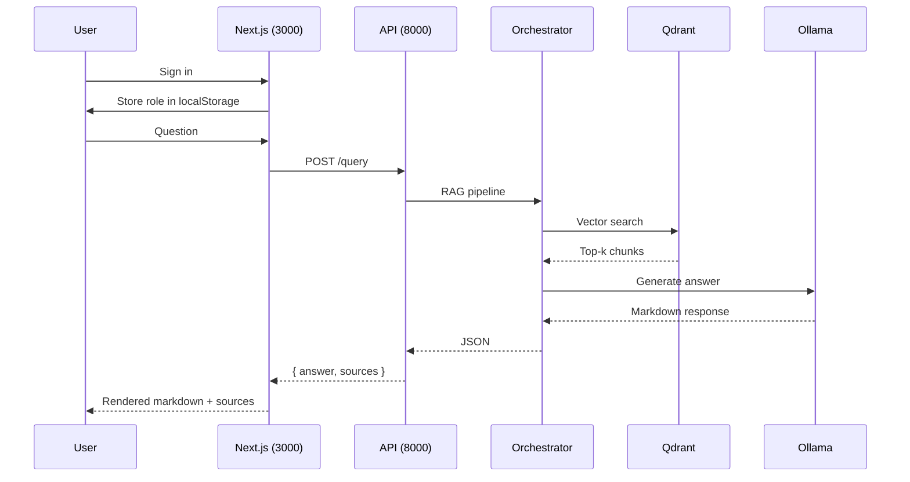
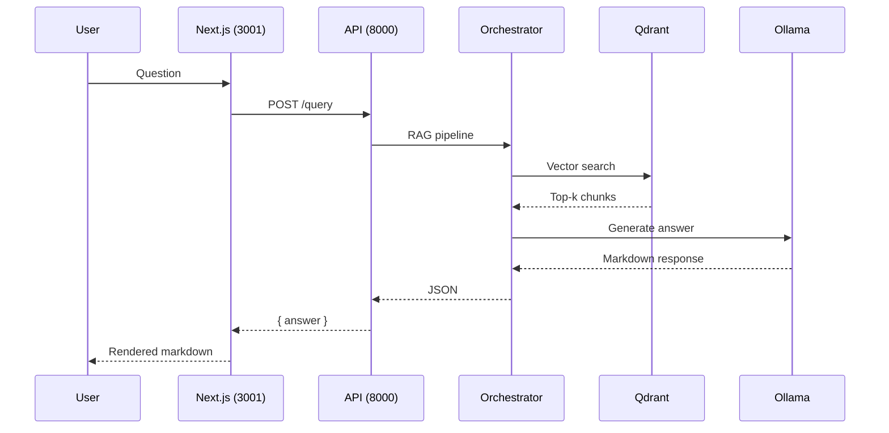

# User Interface

OpenRAG ships a modern authenticated chat interface built with **Next.js** and **ShadcnUI** components. It runs as a Docker container on port **3000**.

## Overview

| Property | Value |
|----------|-------|
| Framework | Next.js (App Router) |
| UI Library | ShadcnUI + Tailwind CSS v4 |
| Theme | Dark mode (default) |
| Port | **3000** |
| API target | `http://localhost:8000` |
| Authentication | Built-in role-based login |

## Access

| URL | Description |
|-----|-------------|
| http://localhost:3000 | Chat interface (all authenticated users) |
| http://localhost:3000/login | Login page |
| http://localhost:3000/admin | Admin panel (admin role only) |

## Authentication

OpenRAG uses a lightweight role-based authentication system:

| Credentials | Role | Access |
|-------------|------|--------|
| `admin` / `admin` | Admin | Chat + Admin panel (document upload, collections, Ollama management) |
| Any other username + password | User | Chat only |

<Note>
For production deployments, replace the credential check in `lib/auth.tsx` with an actual backend authentication endpoint.
</Note>

## Running the Interface

The frontend is deployed as a Docker container:

```bash
# Start the full stack (includes frontend)
sudo docker compose up -d

# Or start the frontend only
sudo docker compose up -d frontend-nextjs
```

Open [http://localhost:3000](http://localhost:3000).

## Architecture



## Key Features

<CardGroup cols={2}>
  <Card title="Authentication" icon="lock">
    Login page with role-based access. Admin users can access the admin panel; regular users are limited to the chat interface.
  </Card>
  <Card title="Markdown Rendering" icon="markdown">
    LLM responses are rendered as full markdown — headers, bold, lists, code blocks.
  </Card>
  <Card title="Source Citations" icon="book">
    Each response includes the source documents and their relevance scores.
  </Card>
  <Card title="Loading State" icon="spinner">
    Shows a "Generating response..." spinner while the LLM generates (typically 60-90s on CPU).
  </Card>
</CardGroup>

## API Request

Each query sends the following payload to the API:

```json
{
  "query": "User question",
  "collection_id": "default",
  "max_results": 5,
  "use_llm": true
}
```

`use_llm: true` routes through the full RAG pipeline (vector search → context augmentation → LLM generation). Setting it to `false` returns only retrieved chunks without LLM synthesis.

## File Structure

```
frontend-nextjs/
├── app/
│   ├── layout.tsx          # Root layout — AuthProvider, dark mode, metadata
│   ├── page.tsx            # Main chat component (protected)
│   ├── login/
│   │   └── page.tsx        # Login page
│   ├── admin/
│   │   └── page.tsx        # Admin panel (admin role only)
│   └── globals.css         # Tailwind + typography imports
├── components/ui/          # ShadcnUI primitives (button, input, card…)
├── lib/
│   ├── auth.tsx            # AuthProvider, useAuth hook, role logic
│   └── utils.ts            # Tailwind className utilities
├── Dockerfile              # Production multi-stage build
├── next.config.ts          # standalone output mode
├── package.json
└── tsconfig.json
```

## Dependencies

| Package | Purpose |
|---------|----------|
| `next` | React framework with App Router |
| `shadcn/ui` | Accessible UI component library |
| `react-markdown` | Render LLM markdown responses |
| `@tailwindcss/typography` | `prose` / `prose-invert` styles |
| `lucide-react` | Icon set |

## Environment Variables

| Variable | Default | Description |
|----------|---------|-------------|
| `NEXT_PUBLIC_API_URL` | `http://localhost:8000` | API Gateway URL baked in at build time |

## Production Build (Docker)

```bash
# Build image
cd openrag
sudo docker compose build frontend-nextjs

# Start container
sudo docker compose up -d frontend-nextjs
```

The Dockerfile uses a multi-stage build (`deps` → `builder` → `runner`) and Next.js `standalone` output mode for a minimal production image.

## Architecture



## Key Features

<CardGroup cols={2}>
  <Card title="Markdown Rendering" icon="markdown">
    LLM responses are rendered as full markdown — headers, bold, lists, code blocks.
  </Card>
  <Card title="Dark Mode" icon="moon">
    Dark theme by default via `<html className="dark">` and ShadcnUI's CSS variables.
  </Card>
  <Card title="Auto-scroll" icon="arrow-down">
    Chat automatically scrolls to the latest message using a `useRef` bottom anchor.
  </Card>
  <Card title="Loading State" icon="spinner">
    Shows a "Generating response..." spinner while the LLM generates (typically 60-90s on CPU).
  </Card>
</CardGroup>

## API Request

Each query sends the following payload to the API:

```json
{
  "query": "User question",
  "collection_id": "default",
  "max_results": 5,
  "use_llm": true
}
```

`use_llm: true` routes through the full RAG pipeline (vector search → context augmentation → LLM generation). Setting it to `false` returns only retrieved chunks without LLM synthesis.

## File Structure

```
frontend-nextjs/
├── app/
│   ├── layout.tsx          # Root layout — dark mode, metadata
│   ├── page.tsx            # Main chat component
│   └── globals.css         # Tailwind + typography imports
├── components/ui/          # ShadcnUI primitives (button, input, card…)
├── package.json
└── tsconfig.json
```

## Dependencies

| Package | Purpose |
|---------|---------|
| `next` | React framework with App Router |
| `shadcn/ui` | Accessible UI component library |
| `react-markdown` | Render LLM markdown responses |
| `@tailwindcss/typography` | `prose` / `prose-invert` styles |
| `lucide-react` | Icon set |

## Production Build

```bash
cd frontend-nextjs
npm run build
npm start          # serves on port 3001
```

For a fully Docker-integrated deployment, add a `Dockerfile` to `frontend-nextjs/` and a service entry in `docker-compose.yml` mapping port 3001.
