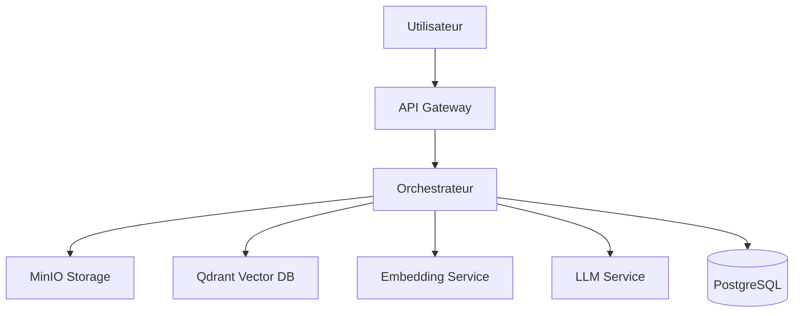

# Bienvenue dans OpenRAG 🚀

OpenRAG est une solution RAG (Retrieval-Augmented Generation) complète, modulaire et prête pour la production. Elle permet d'interroger vos documents en utilisant des modèles de langage avancés avec un contexte précis et pertinent.

## Qu'est-ce qu'un système RAG ?

Un système RAG combine la **recherche d'information** avec la **génération de texte** pour fournir des réponses précises basées sur vos propres documents :

1. **Retrieval (Recherche)** : Trouve les passages pertinents dans votre base documentaire
2. **Augmented (Augmentation)** : Enrichit la requête avec le contexte trouvé
3. **Generation (Génération)** : Génère une réponse cohérente avec un LLM


## Fonctionnalités principales

<CardGroup cols={2}>
  <Card
    title="Upload de documents"
    icon="file-upload"
    href="/guides/upload-documents"
  >
    Supportez PDF, DOCX, TXT, Markdown et plus encore
  </Card>
  <Card
    title="Recherche sémantique"
    icon="magnifying-glass"
    href="/guides/query-system"
  >
    Recherche vectorielle avancée avec Qdrant
  </Card>
  <Card
    title="Génération de réponses"
    icon="robot"
    href="/guides/llm-configuration"
  >
    Supportez Ollama, OpenAI, Anthropic Claude
  </Card>
  <Card
    title="Architecture modulaire"
    icon="cubes"
    href="/architecture/overview"
  >
    Services découplés et scalables avec Docker
  </Card>
</CardGroup>

## Architecture

OpenRAG est composé de plusieurs services spécialisés :



### Composants principaux

- **API Gateway** : Point d'entrée REST pour toutes les requêtes
- **Orchestrateur** : Coordonne le workflow RAG complet
- **MinIO** : Stockage d'objets S3-compatible pour les documents
- **Qdrant** : Base de données vectorielle pour la recherche sémantique
- **Embedding Service** : Génération d'embeddings avec sentence-transformers
- **LLM Service** : Interface avec Ollama, OpenAI ou Anthropic
- **PostgreSQL** : Base de métadonnées et historique

## Cas d'usage

<AccordionGroup>
  <Accordion icon="building" title="Base de connaissances d'entreprise">
    Créez un assistant IA qui connaît tous vos documents internes, procédures et politiques.
  </Accordion>
  
  <Accordion icon="scale-balanced" title="Assistance juridique">
    Interrogez rapidement des contrats, jurisprudences et documents légaux.
  </Accordion>
  
  <Accordion icon="graduation-cap" title="Support client">
    Répondez automatiquement aux questions basées sur votre documentation produit.
  </Accordion>
  
  <Accordion icon="book" title="Recherche académique">
    Explorez et synthétisez de grandes collections de papiers de recherche.
  </Accordion>
</AccordionGroup>

## Démarrage rapide

<Steps>
  <Step title="Installation">
    Clonez le projet et lancez Docker Compose
    ```bash
    git clone https://github.com/your-org/openrag.git
    cd openrag
    docker-compose up -d
    ```
  </Step>
  
  <Step title="Uploadez vos documents">
    Envoyez vos premiers documents via l'API
    ```bash
    curl -X POST http://localhost:8000/documents/upload \
      -F "file=@document.pdf" \
      -F "collection_id=default"
    ```
  </Step>
  
  <Step title="Posez vos questions">
    Interrogez vos documents
    ```bash
    curl -X POST http://localhost:8000/query \
      -H "Content-Type: application/json" \
      -d '{"query": "Quelle est la politique de remboursement ?"}'
    ```
  </Step>
</Steps>

## Prochaines étapes

<CardGroup cols={2}>
  <Card
    title="Guide de démarrage rapide"
    icon="rocket"
    href="/quickstart"
  >
    Installation complète en 10 minutes
  </Card>
  <Card
    title="Architecture détaillée"
    icon="sitemap"
    href="/architecture"
  >
    Comprenez le fonctionnement interne
  </Card>
  <Card
    title="Reference API"
    icon="code"
    href="/api-reference"
  >
    Documentation complète de l'API
  </Card>
  <Card
    title="Guides pratiques"
    icon="book-open"
    href="/guides"
  >
    Tutoriels et bonnes pratiques
  </Card>
</CardGroup>

## Support

Besoin d'aide ? Nous sommes là pour vous :

- 📧 Email: support@openrag.io
- 💬 Discord: [Rejoindre la communauté](https://discord.gg/openrag)
- 🐛 Issues: [GitHub Issues](https://github.com/your-org/openrag/issues)
- 📚 Documentation: [docs.openrag.io](https://docs.openrag.io)
