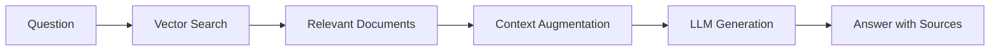

# Welcome to OpenRAG 🚀

OpenRAG is a complete, modular, and production-ready RAG (Retrieval-Augmented Generation) solution. It allows you to query your documents using advanced language models with precise and relevant context.

## What is a RAG system?

A RAG system combines **information retrieval** with **text generation** to provide accurate answers based on your own documents:

1. **Retrieval**: Finds relevant passages in your document base
2. **Augmented**: Enriches the query with the found context
3. **Generation**: Generates a coherent response with an LLM

### RAG Workflow



## Main Features

<CardGroup cols={2}>
  <Card
    title="Document Upload"
    icon="file-upload"
  >
    PDF, DOCX, TXT, Markdown - Automatic processing
  </Card>
  <Card
    title="Semantic Search"
    icon="magnifying-glass"
  >
    Advanced vector search with Qdrant
  </Card>
  <Card
    title="Answer Generation"
    icon="robot"
  >
    Ollama, OpenAI, Anthropic Claude
  </Card>
  <Card
    title="Modular Architecture"
    icon="cubes"
    href="/architecture"
  >
    Decoupled microservices with Docker
  </Card>
</CardGroup>

## Main Components

OpenRAG consists of **10 Docker services**:

| Service | Port | Role |
|---------|------|------|
| **frontend-nextjs** | 3001 | User chat interface (Next.js + ShadcnUI) |
| **frontend-admin** | 8502 | Admin panel, upload, stats (Streamlit) |
| **api** | 8000 | REST API (FastAPI) |
| **orchestrator** | 8001 | RAG workflow coordination |
| **embedding** | 8002 | Embeddings generation (sentence-transformers) |
| **ollama** | 11434 | Local LLM server |
| **qdrant** | 6333 | Vector database |
| **postgres** | 5432 | Metadata and history |
| **redis** | 6379 | Cache and queues |
| **minio** | 9000/9001 | File storage (S3-compatible) |

## Use Cases

<AccordionGroup>
  <Accordion icon="building" title="Enterprise Knowledge Base">
    Create an AI assistant that knows all your internal documents, procedures, and company policies.
  </Accordion>
  
  <Accordion icon="scale-balanced" title="Legal Assistance">
    Quickly query contracts, case law, and legal documents with precise citations.
  </Accordion>
  
  <Accordion icon="graduation-cap" title="Customer Support">
    Automatically answer questions based on your product documentation and FAQ.
  </Accordion>
  
  <Accordion icon="book" title="Academic Research">
    Explore and synthesize large collections of scientific research papers.
  </Accordion>
</AccordionGroup>

## Quick Start

<Steps>
  <Step title="Clone and Launch">
    ```bash
    git clone https://github.com/3ntrop1a/openrag.git
    cd openrag
    sudo docker-compose up -d
    ```
  </Step>
  
  <Step title="Download LLM Model">
    ```bash
    docker exec -it openrag-ollama ollama pull llama3.1:8b
    ```
  </Step>
  
  <Step title="Open Chat Interface">
    Navigate to http://localhost:3001 and ask your first question!
  </Step>
</Steps>

<Info>
**First time?** Initial startup takes 10-15 minutes (downloading Docker images + 4.9 GB LLM model)
</Info>

## Next Steps

<CardGroup cols={2}>
  <Card
    title="Quick Start Guide"
    icon="rocket"
    href="/quickstart"
  >
    Complete installation in 5 minutes
  </Card>
  <Card
    title="Detailed Architecture"
    icon="sitemap"
    href="/architecture"
  >
    Understand the internal workings
  </Card>
  <Card
    title="System Requirements"
    icon="server"
    href="/installation/requirements"
  >
    Minimum configuration: 16 GB RAM, optional GPU
  </Card>
  <Card
    title="API Reference"
    icon="code"
    href="/api-reference/introduction"
  >
    Complete REST API documentation
  </Card>
</CardGroup>

## Technical Characteristics

<AccordionGroup>
  <Accordion icon="gauge-high" title="Performance">
    - **With GPU:** 1-3s per query
    - **Without GPU:** 5-15s per query (after warm-up)
    - **Vector search:** 100-200ms
    - **Indexing:** 10-30s per PDF document
  </Accordion>

  <Accordion icon="database" title="Scalability">
    - Horizontally scalable microservices architecture
    - Support for millions of documents
    - Redis for distributed cache
    - PostgreSQL for metadata
    - Qdrant for high-performance vector search
  </Accordion>

  <Accordion icon="shield-halved" title="Security">
    - Data stored locally (no third-party cloud)
    - Docker service isolation
    - Support for local LLMs (Ollama) for total privacy
    - Compatible with cloud LLMs (OpenAI, Claude) if desired
  </Accordion>

  <Accordion icon="puzzle-piece" title="Extensibility">
    - Easy integration of new document formats
    - Multi-LLM support (Ollama, OpenAI, Anthropic)
    - REST API for integration into your applications
    - Multiple collections for document segmentation
  </Accordion>
</AccordionGroup>

## Support and Contributions

- 🐛 **Issues:** [GitHub Issues](https://github.com/3ntrop1a/openrag/issues)
- 💻 **Source Code:** [github.com/3ntrop1a/openrag](https://github.com/3ntrop1a/openrag)
- 📖 **Documentation:** This Mintlify documentation
