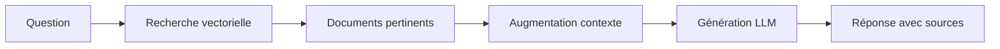

# Bienvenue dans OpenRAG 🚀

OpenRAG est une solution RAG (Retrieval-Augmented Generation) complète, modulaire et prête pour la production. Elle permet d'interroger vos documents en utilisant des modèles de langage avancés avec un contexte précis et pertinent.

## Qu'est-ce qu'un système RAG ?

Un système RAG combine la **recherche d'information** avec la **génération de texte** pour fournir des réponses précises basées sur vos propres documents :

1. **Retrieval (Recherche)** : Trouve les passages pertinents dans votre base documentaire
2. **Augmented (Augmentation)** : Enrichit la requête avec le contexte trouvé
3. **Generation (Génération)** : Génère une réponse cohérente avec un LLM

### Workflow RAG



## Fonctionnalités principales

<CardGroup cols={2}>
  <Card
    title="Upload de documents"
    icon="file-upload"
  >
    PDF, DOCX, TXT, Markdown - Processing automatique
  </Card>
  <Card
    title="Recherche sémantique"
    icon="magnifying-glass"
  >
    Recherche vectorielle avancée avec Qdrant
  </Card>
  <Card
    title="Génération de réponses"
    icon="robot"
  >
    Ollama, OpenAI, Anthropic Claude
  </Card>
  <Card
    title="Architecture modulaire"
    icon="cubes"
    href="/architecture"
  >
    Microservices découplés avec Docker
  </Card>
</CardGroup>

## Composants principaux

OpenRAG est composé de **10 services Docker** :

| Service | Port | Rôle |
|---------|------|------|
| **frontend-user** | 8501 | Interface chat utilisateur (Streamlit) |
| **frontend-admin** | 8502 | Panel admin, upload, stats (Streamlit) |
| **api** | 8000 | API REST (FastAPI) |
| **orchestrator** | 8001 | Coordination workflows RAG |
| **embedding** | 8002 | Génération embeddings (sentence-transformers) |
| **ollama** | 11434 | Serveur LLM local |
| **qdrant** | 6333 | Base vectorielle |
| **postgres** | 5432 | Métadonnées et historique |
| **redis** | 6379 | Cache et queues |
| **minio** | 9000/9001 | Stockage fichiers (S3-compatible) |

## Cas d'usage

<AccordionGroup>
  <Accordion icon="building" title="Base de connaissances d'entreprise">
    Créez un assistant IA qui connaît tous vos documents internes, procédures et politiques d'entreprise.
  </Accordion>
  
  <Accordion icon="scale-balanced" title="Assistance juridique">
    Interrogez rapidement des contrats, jurisprudences et documents légaux avec citations précises.
  </Accordion>
  
  <Accordion icon="graduation-cap" title="Support client">
    Répondez automatiquement aux questions basées sur votre documentation produit et FAQ.
  </Accordion>
  
  <Accordion icon="book" title="Recherche académique">
    Explorez et synthétisez de grandes collections de papiers de recherche scientifique.
  </Accordion>
</AccordionGroup>

## Démarrage rapide

<Steps>
  <Step title="Cloner et lancer">
    ```bash
    git clone https://github.com/3ntrop1a/openrag.git
    cd openrag
    sudo docker-compose up -d
    ```
  </Step>
  
  <Step title="Télécharger le modèle LLM">
    ```bash
    docker exec -it openrag-ollama ollama pull llama3.1:8b
    ```
  </Step>
  
  <Step title="Ouvrir l'interface chat">
    Naviguez vers http://localhost:8501 et posez votre première question !
  </Step>
</Steps>

<Info>
**Première fois ?** Le démarrage initial prend 10-15 minutes (téléchargement images Docker + modèle LLM 4.9 GB)
</Info>

## Prochaines étapes

<CardGroup cols={2}>
  <Card
    title="Guide de démarrage rapide"
    icon="rocket"
    href="/quickstart"
  >
    Installation complète en 5 minutes
  </Card>
  <Card
    title="Architecture détaillée"
    icon="sitemap"
    href="/architecture"
  >
    Comprendre le fonctionnement interne
  </Card>
  <Card
    title="Prérequis système"
    icon="server"
    href="/installation/requirements"
  >
    Configuration minimale: 16 GB RAM, GPU optionnel
  </Card>
  <Card
    title="API Reference"
    icon="code"
    href="/api-reference/introduction"
  >
    Documentation complète de l'API REST
  </Card>
</CardGroup>

## Caractéristiques techniques

<AccordionGroup>
  <Accordion icon="gauge-high" title="Performance">
    - **Avec GPU:** 1-3s par requête
    - **Sans GPU:** 5-15s par requête (après warm-up)
    - **Recherche vectorielle:** 100-200ms
    - **Indexation:** 10-30s par document PDF
  </Accordion>

  <Accordion icon="database" title="Scalabilité">
    - Architecture microservices horizontalement scalable
    - Support de millions de documents
    - Redis pour cache distribué
    - PostgreSQL pour métadonnées
    - Qdrant pour recherche vectorielle haute performance
  </Accordion>

  <Accordion icon="shield-halved" title="Sécurité">
    - Données stockées localement (pas de cloud tiers)
    - Isolation des services Docker
    - Support des LLM locaux (Ollama) pour confidentialité totale
    - Compatible avec LLM cloud (OpenAI, Claude) si souhaité
  </Accordion>

  <Accordion icon="puzzle-piece" title="Extensibilité">
    - Intégration facile de nouveaux formats de documents
    - Support multi-LLM (Ollama, OpenAI, Anthropic)
    - API REST pour intégration dans vos applications
    - Collection multiples pour segmentation des documents
  </Accordion>
</AccordionGroup>

## Support et contributions

- 🐛 **Issues:** [GitHub Issues](https://github.com/3ntrop1a/openrag/issues)
- 💻 **Code source:** [github.com/3ntrop1a/openrag](https://github.com/3ntrop1a/openrag)
- 📖 **Documentation:** Cette documentation Mintlify
