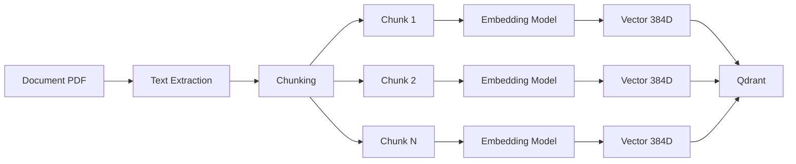

# Embedding & Chunking Service

The Embedding service is responsible for transforming document text into vector representations that can be searched semantically. It handles two critical tasks: **chunking** (splitting documents into manageable pieces) and **embedding** (converting text to vectors).

## What is Chunking?

**Chunking** is the process of splitting large documents into smaller, overlapping segments of text. This is essential for RAG systems because:

1. **LLM Context Limits**: Language models have token limits (~8K-32K tokens)
2. **Semantic Precision**: Smaller chunks provide more precise context
3. **Better Retrieval**: Focused chunks improve search relevance

### Chunking Strategy in OpenRAG

```python
# Current configuration (configurable)
CHUNK_SIZE = 1000        # characters per chunk
CHUNK_OVERLAP = 200      # overlap between consecutive chunks
MIN_CHUNK_SIZE = 100     # minimum chunk size
```

**Example:**

```
Original Document (5000 characters)
↓
Chunk 1: characters 0-1000     (1000 chars)
Chunk 2: characters 800-1800   (1000 chars, 200 overlap)
Chunk 3: characters 1600-2600  (1000 chars, 200 overlap)
Chunk 4: characters 2400-3400  (1000 chars, 200 overlap)
Chunk 5: characters 3200-4200  (1000 chars, 200 overlap)
Chunk 6: characters 4000-5000  (1000 chars, 200 overlap)
```

**Why Overlap?**
- Ensures important information isn't split mid-sentence
- Provides context continuity between chunks
- Improves retrieval accuracy by avoiding boundary effects

### Chunking Method

OpenRAG uses **recursive character splitting** with sentence awareness:

1. **Sentence Detection**: Uses spaCy to detect sentence boundaries
2. **Smart Splitting**: Tries to break at sentence boundaries, not mid-sentence
3. **Metadata Preservation**: Each chunk retains document metadata (filename, page, position)

```python
from langchain.text_splitter import RecursiveCharacterTextSplitter

text_splitter = RecursiveCharacterTextSplitter(
    chunk_size=1000,
    chunk_overlap=200,
    length_function=len,
    separators=["\n\n", "\n", ". ", " ", ""]
)
```

## What is Embedding?

**Embedding** is the process of converting text into a numerical vector representation. Similar texts produce similar vectors, enabling semantic search.

### Model Used: sentence-transformers/all-MiniLM-L6-v2

**Characteristics:**
- **Dimensions**: 384 (each text becomes a 384-dimensional vector)
- **Model Size**: 80 MB
- **Speed**: ~1000 sentences/second on CPU
- **Quality**: Good balance between speed and accuracy
- **Language**: Optimized for English, works reasonably on other languages

**Alternatives** (configurable in settings):
| Model | Dimensions | Size | Speed | Quality |
|-------|-----------|------|-------|---------|
| all-MiniLM-L6-v2 | 384 | 80 MB | Fast | Good |
| all-mpnet-base-v2 | 768 | 420 MB | Medium | Excellent |
| multilingual-e5-base | 768 | 1.1 GB | Medium | Multilingual |
| instructor-large | 768 | 1.3 GB | Slow | Excellent |

### Embedding Process



**Example Vector Output:**

```python
text = "How to configure an automated attendant?"

# After embedding:
vector = [
    0.0234, -0.1234, 0.5678, ..., 0.0912  # 384 dimensions
]

# Vector properties:
len(vector)  # 384
type(vector)  # numpy.ndarray
vector.shape  # (384,)
```

## Service Architecture

### Docker Service Configuration

```yaml
# docker-compose.yml
embedding:
  build: ./embedding-service
  container_name: openrag-embedding
  ports:
    - "8002:8002"
  environment:
    - MODEL_NAME=sentence-transformers/all-MiniLM-L6-v2
    - BATCH_SIZE=32
    - MAX_LENGTH=512
  volumes:
    - ./models:/models  # Cache for model weights
  networks:
    - openrag-network
```

### API Endpoints

The embedding service exposes a FastAPI server:

**Port**: 8002 (internal only)

**Endpoints:**

1. **POST /embed**
   ```bash
   curl -X POST http://localhost:8002/embed \
     -H "Content-Type: application/json" \
     -d '{
       "texts": [
         "First chunk of text",
         "Second chunk of text"
       ]
     }'
   ```
   
   Response:
   ```json
   {
     "embeddings": [
       [0.0234, -0.1234, ...],  // 384 dimensions
       [0.0567, -0.0891, ...]   // 384 dimensions
     ],
     "model": "all-MiniLM-L6-v2",
     "dimensions": 384
   }
   ```

2. **POST /chunk**
   ```bash
   curl -X POST http://localhost:8002/chunk \
     -H "Content-Type: application/json" \
     -d '{
       "text": "Long document text here...",
       "chunk_size": 1000,
       "chunk_overlap": 200
     }'
   ```
   
   Response:
   ```json
   {
     "chunks": [
       {
         "text": "First chunk...",
         "start_pos": 0,
         "end_pos": 1000
       },
       {
         "text": "Second chunk...",
         "start_pos": 800,
         "end_pos": 1800
       }
     ],
     "total_chunks": 25
   }
   ```

3. **GET /health**
   ```bash
   curl http://localhost:8002/health
   ```

## Performance Metrics

### Chunking Performance

**Test Setup**: 31 PDF documents, total 456 pages, ~2.3 MB text content

| Metric | Value |
|--------|-------|
| Average chunks per document | 30-50 chunks |
| Chunking speed | ~5000 characters/second |
| Time per document | 2-5 seconds |

### Embedding Performance

**Hardware**: CPU-only mode (no GPU)

| Metric | Value |
|--------|-------|
| Embeddings/second | ~1000 chunks/second |
| Time per document (avg 40 chunks) | ~0.04 seconds |
| Batch processing (32 chunks) | ~0.03 seconds |
| Total time for 31 PDFs (928 chunks) | ~1 second |

**With GPU** (NVIDIA RTX 3060):
| Metric | Value |
|--------|-------|
| Embeddings/second | ~5000 chunks/second |
| Time per document | `<0.01` seconds |

## Configuration Options

### Environment Variables

```bash
# In docker-compose.yml or .env

# Model selection
EMBEDDING_MODEL=sentence-transformers/all-MiniLM-L6-v2

# Chunking parameters
CHUNK_SIZE=1000
CHUNK_OVERLAP=200
MIN_CHUNK_SIZE=100

# Performance tuning
EMBEDDING_BATCH_SIZE=32
MAX_SEQUENCE_LENGTH=512
DEVICE=cpu  # or cuda for GPU
```

### Changing the Embedding Model

To use a different model:

1. Update `EMBEDDING_MODEL` in Docker Compose
2. Restart the embedding service:
   ```bash
   sudo docker-compose restart embedding
   ```

3. Re-index existing documents (they must be embedded with the same model):
   ```bash
   # Delete old collection
   curl -X DELETE http://localhost:6333/collections/default
   
   # Re-upload documents
   # They will be re-chunked and re-embedded
   ```

<Warning>
**Changing models requires re-indexing all documents**. Vectors from different models are not compatible.
</Warning>

## Advanced: Custom Chunking Strategies

For specialized use cases, you can implement custom chunking:

### Semantic Chunking

Split based on semantic similarity rather than fixed size:

```python
from langchain.text_splitter import SemanticChunker

semantic_chunker = SemanticChunker(
    embeddings=embedding_model,
    breakpoint_threshold_type="percentile"
)
```

### Hierarchical Chunking

Create parent-child chunk relationships:

```python
# Parent chunks (large context)
parent_size = 2000

# Child chunks (precise retrieval)
child_size = 400
```

## Monitoring

View embedding service logs:

```bash
sudo docker-compose logs -f embedding
```

Expected output:
```
INFO: Model loaded: all-MiniLM-L6-v2 (384 dimensions)
INFO: Embedding service ready on port 8002
INFO: Processed batch of 32 chunks in 0.03s
```

## Troubleshooting

### Slow Embedding

**Symptom**: Embedding takes >10 seconds per document

**Solutions**:
1. Increase batch size: `EMBEDDING_BATCH_SIZE=64`
2. Use smaller model: `all-MiniLM-L6-v2` instead of `all-mpnet-base-v2`
3. Add GPU support for 5x speedup

### Out of Memory

**Symptom**: Service crashes with `CUDA out of memory` or `Killed`

**Solutions**:
1. Reduce batch size: `EMBEDDING_BATCH_SIZE=16`
2. Reduce max sequence length: `MAX_SEQUENCE_LENGTH=256`
3. Use smaller model
4. Increase Docker RAM allocation

## Next Steps

<CardGroup cols={2}>
  <Card
    title="Qdrant Vector DB"
    icon="database"
    href="/components/qdrant"
  >
    Learn how embeddings are stored and searched
  </Card>
  <Card
    title="Ollama LLM"
    icon="robot"
    href="/components/ollama"
  >
    Understand LLM response generation
  </Card>
</CardGroup>
