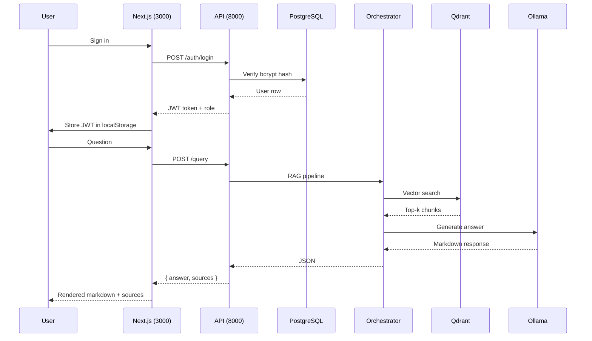

# User Interface

OpenRAG ships a modern authenticated chat interface built with **Next.js** and **ShadcnUI** components. It runs as a Docker container on port **3000**.

## Overview

| Property | Value |
|----------|-------|
| Framework | Next.js (App Router) |
| UI Library | ShadcnUI + Tailwind CSS v4 |
| Theme | Dark mode (default) |
| Port | **3000** |
| API target | `http://localhost:8000` |
| Authentication | Built-in role-based login |

## Access

| URL | Description |
|-----|-------------|
| http://localhost:3000 | Chat interface (all authenticated users) |
| http://localhost:3000/login | Login page |
| http://localhost:3000/admin | Admin panel (admin role only) |

## Authentication

OpenRAG uses **JWT-based authentication** backed by PostgreSQL. Credentials are verified against the `users` table — not hardcoded anywhere.

| Role | Access |
|------|--------|
| `admin` | Chat + full Admin panel (documents, upload, Ollama, **user management**) |
| `user` | Chat interface only |

**Default admin account** is seeded automatically on first startup: `admin` / `admin`.  
Change this password immediately from the Users tab in the Admin panel.

### How it works

1. `POST /auth/login` validates credentials against bcrypt-hashed passwords in PostgreSQL
2. A signed **JWT token** (HS256, 24h expiry) is returned and stored in `localStorage`
3. All admin API calls include `Authorization: Bearer <token>`
4. The `/auth/me` endpoint validates the token and returns the current user's role

<Warning>
Set `JWT_SECRET_KEY` to a long random string in production. The default value is insecure.
</Warning>

## Running the Interface

The frontend is deployed as a Docker container:

```bash
# Start the full stack (includes frontend)
sudo docker compose up -d

# Or start the frontend only
sudo docker compose up -d frontend-nextjs
```

Open [http://localhost:3000](http://localhost:3000).

## Architecture



## Key Features

<CardGroup cols={2}>
  <Card title="Authentication" icon="lock">
    Login page with role-based access. Admin users can access the admin panel; regular users are limited to the chat interface.
  </Card>
  <Card title="Markdown Rendering" icon="markdown">
    LLM responses are rendered as full markdown — headers, bold, lists, code blocks.
  </Card>
  <Card title="Source Citations" icon="book">
    Each response includes the source documents and their relevance scores.
  </Card>
  <Card title="Loading State" icon="spinner">
    Shows a "Generating response..." spinner while the LLM generates (typically 60-90s on CPU).
  </Card>
</CardGroup>

## API Request

Each query sends the following payload to the API:

```json
{
  "query": "User question",
  "collection_id": "default",
  "max_results": 5,
  "use_llm": true
}
```

`use_llm: true` routes through the full RAG pipeline (vector search → context augmentation → LLM generation). Setting it to `false` returns only retrieved chunks without LLM synthesis.

## File Structure

```
frontend-nextjs/
├── app/
│   ├── layout.tsx          # Root layout — AuthProvider, dark mode, metadata
│   ├── page.tsx            # Main chat component (protected)
│   ├── login/
│   │   └── page.tsx        # Login page
│   ├── admin/
│   │   └── page.tsx        # Admin panel (admin role only)
│   └── globals.css         # Tailwind + typography imports
├── components/ui/          # ShadcnUI primitives (button, input, card…)
├── lib/
│   ├── auth.tsx            # AuthProvider, useAuth hook, role logic
│   └── utils.ts            # Tailwind className utilities
├── Dockerfile              # Production multi-stage build
├── next.config.ts          # standalone output mode
├── package.json
└── tsconfig.json
```

## Dependencies

| Package | Purpose |
|---------|----------|
| `next` | React framework with App Router |
| `shadcn/ui` | Accessible UI component library |
| `react-markdown` | Render LLM markdown responses |
| `@tailwindcss/typography` | `prose` / `prose-invert` styles |
| `lucide-react` | Icon set |

## Environment Variables

| Variable | Default | Description |
|----------|---------|-------------|
| `NEXT_PUBLIC_API_URL` | `http://localhost:8000` | API Gateway URL baked in at build time |
| `JWT_SECRET_KEY` | `openrag-change-me-in-production-please` | Secret used to sign JWT tokens (set this in production) |
| `JWT_EXPIRE_MINUTES` | `1440` | Token lifetime in minutes (default: 24 hours) |

## Production Build (Docker)

```bash
# Build image
cd openrag
sudo docker compose build frontend-nextjs

# Start container
sudo docker compose up -d frontend-nextjs
```

The Dockerfile uses a multi-stage build (`deps` → `builder` → `runner`) and Next.js `standalone` output mode for a minimal production image.

## Admin Panel

The admin panel at `http://localhost:3000/admin` is accessible only to users with the `admin` role. It has **8 tabs**, each dedicated to a different aspect of the system.

### Dashboard

The landing tab. Pulls live data from `GET /stats` and displays:

- **Primary stats row**: total documents (e.g. 534), total vectors (e.g. 1909 across all Qdrant collections), total chunks, total queries
- **Secondary stats row**: average query time (ms), queries in the last 24h / 7d, number of collections, number of users
- **Document status breakdown**: a color-coded progress bar showing processed / processing / failed counts at a glance
- **Qdrant collections**: one card per collection with vector count, indexed count, and status badge
- **Service health grid**: live reachability check for Orchestrator, Qdrant, and MinIO with green/red indicators

### Collections

Queries `GET /collections` and shows one card per Qdrant collection with:

- Collection name and status badge (`green` / degraded)
- **Vectors** count (actual Qdrant points, not a cached DB value)
- **Indexed vectors** count
- **Segments** count
- **Vector size** (e.g. 768 for multilingual model)
- Creation date

This tab was specifically built to fix the old bug where the UI showed "50 documents" when there were actually 500+ — vector counts come directly from the Qdrant API.

### Documents

Paginated list of all documents from `GET /documents` (50 per page):

- **Search** by filename (client-side filter)
- **Status filter** dropdown (processed / processing / failed / uploaded)
- Per-document columns: filename, status (color-coded), collection, chunk count
- **Delete** button per document (removes from DB + Qdrant vectors)
- Pagination controls with total count display

### Upload

File upload form:

- Click-to-select file area (PDF, DOCX, TXT, MD)
- Collection name input (default: `default`)
- Submit → `POST /documents/upload` multipart form
- Success banner showing the assigned `document_id`
- Processing happens asynchronously in the Orchestrator — check the Documents tab for status

### History

Paginated query log from `GET /history` (admin JWT required, 20 per page):

- Total query count
- Per-query row: question text, timestamp (relative e.g. "3h ago"), execution time, user ID, number of sources
- **Expandable row**: click to reveal the full LLM response and the list of source documents with relevance scores
- Pagination controls

### Monitoring

Links and embeds for the observability stack:

| Link | Description |
|------|-------------|
| Prometheus | http://localhost:9090 — metric scraping + alerting |
| Grafana | http://localhost:3002 — pre-configured OpenRAG Overview dashboard |
| Qdrant UI | http://localhost:6333/dashboard — vector store inspector |
| MinIO Console | http://localhost:9001 — S3-compatible object storage |
| API Swagger | http://localhost:8000/docs — FastAPI interactive docs |

An embedded Grafana iframe shows the live dashboard directly in the page. Quick-links to common Prometheus query graphs (request rate, P95 latency, Qdrant collections) are also available.

### Ollama

Pulls data from the Ollama HTTP API (port 11434):

- Ollama version
- **Running models**: models currently loaded in RAM (shown with animated dot)
- **Installed models**: all pulled models with disk size and last-modified date

Example commands shown when no model is installed:
```bash
docker exec -it openrag-ollama ollama pull llama3.1:8b
```

### Users

Full user management backed by `GET/POST/DELETE/PATCH /auth/users` (admin JWT required):

- **User list**: username, role badge (`admin` / `user`), creation date
- **Create user**: inline form — username, password (visibility toggle), role selector (`user` or `admin`)
- **Delete user**: one-click delete with confirmation (cannot delete your own account)
- **Change password**: expandable inline form per user — minimum 4 characters

All requests include `Authorization: Bearer <token>` automatically.
